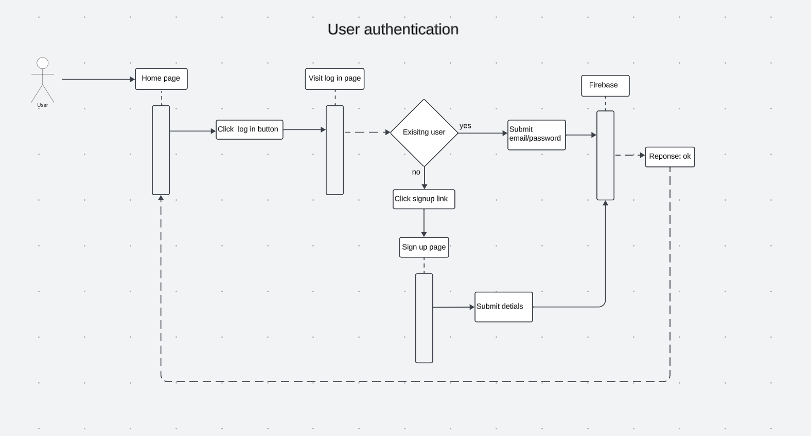

## High Level Component Diagram 
](Highcomponentdiagram.png)
```
Localhost (Web Server):

Description: Acts as the web server responsible for delivering static files (HTML, CSS, JavaScript) to the client's browser.
Responsibilities:
Hosts and serves static files needed for the web application.
Handles incoming HTTP requests from clients.
```
```
Next.js (App Server):

Description: Utilizes Node.js as a server-side JavaScript runtime to execute server-side code for the web application.
Responsibilities:
Executes server-side application logic and manages dynamic content generation.
Facilitates communication between the client-side (browser) and the server-side.
```
```
Firebase (Database Server):

Description: Functions as the database server, responsible for storing and managing persistent data essential for the web application.
Responsibilities:
Stores and retrieves data critical to the application, such as user information and preferences.
Offers a secure and scalable solution for handling the application's data.
```
## Relationship Diagram 
](ERDD.png)
```
In the relational framework of our Recipe-Revive application, the central "User" entity establishes pivotal connections with other entities, such as "savedRecipe," "createdRecipe," "Recipe," "reviews," and "ingredient." The "User" entity is at the core of the system, forming associations with various entities to encapsulate key interactions.
```

- User Entity:

Establishes relationships with "savedRecipe" and "createdRecipe" entities, representing the user's capacity to save multiple recipes and create numerous recipes.

- savedRecipe Entity:

Has a relationship with the "Recipe" entity, signifying that instances of "savedRecipe" correspond to specific recipes saved by the user.

- createdRecipe Entity:

Associated with the "User" entity, highlighting that users can create multiple recipes. This entity embodies the recipes generated by users.

- Recipe Entity:

Connected to "savedRecipe," "searchRecipe," and "reviews" entities, showcasing its central role. "savedRecipe" represents instances of saved recipes, "searchRecipe" involves the search and retrieval of recipes, and "reviews" encapsulates user feedback on recipes.

- reviews Entity:


Linked to the "Recipe" entity, indicating its role in capturing user reviews and feedback on specific recipes.

- ingredient Entity:
  
 Associated with the "Recipe" entity to represent the various ingredients used in recipes.


## Flow Diagram 

```
The authentication flow diagram for user login/signup in the Recipe-Revive application delineates a step-by-step process for ensuring a smooth authentication experience. Commencing with the user landing on the home page, they are presented with the choice to either log in or sign up. Clicking the designated button directs users to the login/signup page.

For existing users, the process involves conventional login steps, while new users opting for signup click a link, providing a new email address and password through a dedicated form. The submitted signup information is then securely stored in the Firebase database, a crucial component of our data management.

Upon successful login or signup, users are seamlessly redirected back to the home page, now authenticated and ready to access the full array of features within the Recipe-Revive application. This flow ensures a user-friendly and secure journey, integrating Firebase for efficient authentication data handling.
```
