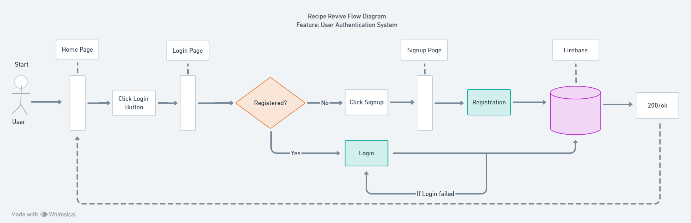

# Recipe Revive Architecture

This document describes the overall architecture of the Recipe Revive Application. 

## High-level Component Diagram

In the depicted component diagram, the system comprises several key components. The web client, represented as a rectangle, interacts with the local web server (localhost) using the HTTPS/JSON protocol, ensuring secure data transmission. The web server, in turn, communicates with the app server (Node.js) via HTTP/JSON. This interaction represents the flow of data and requests between the frontend and backend components of the application. Additionally, the app server communicates with the database server (Firebase) using the HTTPS/JSON protocol, ensuring secure exchanges for storing and retrieving data. 

## ER Diagram

In the proposed entity relationship diagram, the system is structured around several key entities representing core aspects of a recipe-sharing application. The central entity, "User," encapsulates user-specific information such as userID, name, email, password, and user picture. This entity forms one-to-many relationships with "SavedRecipe", "CreatedRecipe" and "Recipe" indicating that a user can have multiple saved recipes, created recipes, and contributed recipes. The "Recipe" entity, in turn, establishes one-to-many relationships with "Instruction" and "RecipeIngredient," reflecting the comprehensive details associated with a recipe, including cooking instructions, nutritional information, and ingredient composition. Additionally, the "Recipe" entity fosters one-to-many relationships with "SavedRecipe" and "CreatedRecipe," highlighting that each recipe can be saved and created by multiple users. The "Unit" and "Ingredient" entities contribute to the system by defining units of measurement and individual ingredients, respectively, forming one-to-many relationships with the "RecipeIngredient" entity. 

## Flow Diagram

The following flow diagram outlines the process of user authentication flow within the system. Users begin at the home page, where they have the option to click on the login button, initiating a redirection to the login page. The login page presents a decision point with a diamond shape indicating whether the user is registered. If not, users can navigate to the signup page through a signup link, filling out registration information that is then connected to the Firebase database for storage. If users are registered, they proceed to the login information rectangle, where they enter their credentials. The login information is sent to the Firebase database, with a check for failed logins leading users back to the login information stage. Upon successful login, an arrow points to the rectangle labeled "200/OK," signifying a successful HTTP response, and users are redirected back to the home page. 
